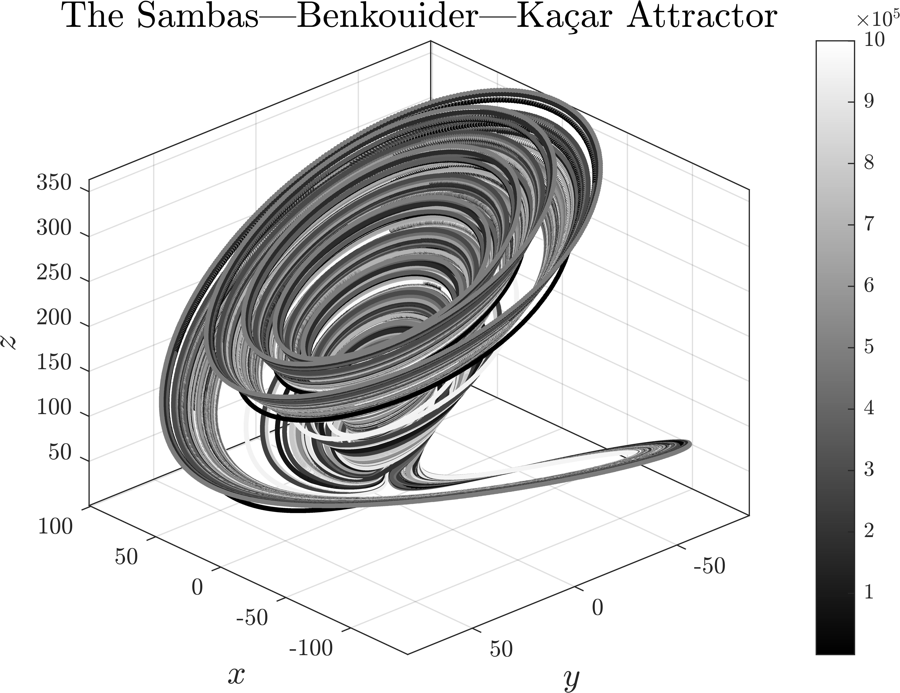

# Dynamics of Chaotic Attractors

This is a sequel to my repository [Dynamics of Nonlinear Attractors](https://github.com/whydenyscry/Dynamics-of-Nonlinear-Attractors) on which I have reached the limit for using mathematical expressions. This repository will also only consider 3D attractors, but I still plan to create a separate repository for hyperchaotic attractors.

The plots are also available on Pinterest and Behance:

## The Sambas—Benkouider—Kaçar Attractor
**Reference:**\
[Sambas, A., Benkouider, K., Kaçar, S., Ceylan, N., Vaidyanathan, S., Sulaiman, I. M., Mohamed, M. A., Ayob, A. F. M., & Muni, S. S. (2024). Dynamic Analysis and Circuit Design of a New 3D Highly Chaotic System and its Application to Pseudo Random Number Generator (PRNG) and Image Encryption. SN Computer Science, 5(4).](https://doi.org/10.1007/s42979-024-02766-9)

$$
\begin{cases}
	\frac{\mathrm{d}x}{\mathrm{d}t} = \alpha\left(y-x\right) + yz,	\\
	\frac{\mathrm{d}y}{\mathrm{d}t} = x\left(\beta-z\right)-1, \\
	\frac{\mathrm{d}z}{\mathrm{d}t} = x^2+xz-\varsigma z,
\end{cases}
$$

$$
\begin{bmatrix}
	\alpha\\
	\beta\\
	\varsigma
\end{bmatrix} = \begin{bmatrix}
	20\\
	50\\
	10
\end{bmatrix}.
$$

  

