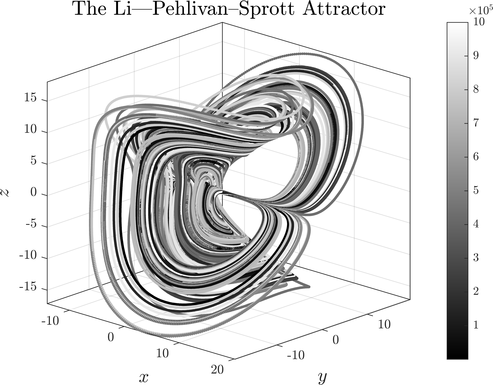

# Dynamics of Chaotic 3D Attractors: Part 2

This is a sequel to my repository [Dynamics of Chaotic 3D Attractors: Part 1](https://github.com/whydenyscry/Dynamics-of-Chaotic-Attractors-Part-1) on which I have reached the limit for using mathematical expressions. This repository will also only consider 3D attractors.

The plots are also available on Pinterest and Behance:

## Relevant Repositories:
- [Dynamics of Chaotic 3D Attractors: Part 1](https://github.com/whydenyscry/Dynamics-of-Chaotic-Attractors-Part-1)
- [Dynamics Of Hyperchaotic High-Dimensional Attractors](https://github.com/whydenyscry/Dynamics-of-Hyperchaotic-Attractors)

## The Sambas—Benkouider—Kaçar Attractor
**Reference:**\
[Sambas, A., Benkouider, K., Kaçar, S., Ceylan, N., Vaidyanathan, S., Sulaiman, I. M., Mohamed, M. A., Ayob, A. F. M., & Muni, S. S. (2024). Dynamic Analysis and Circuit Design of a New 3D Highly Chaotic System and its Application to Pseudo Random Number Generator (PRNG) and Image Encryption. SN Computer Science, 5(4).](https://doi.org/10.1007/s42979-024-02766-9)

$$
\begin{cases}
	\frac{\mathrm{d}x}{\mathrm{d}t} = \alpha\left(y-x\right) + yz,	\\
	\frac{\mathrm{d}y}{\mathrm{d}t} = x\left(\beta-z\right)-1, \\
	\frac{\mathrm{d}z}{\mathrm{d}t} = x^2+xz-\varsigma z,
\end{cases}
$$

$$
\begin{bmatrix}
	\alpha\\
	\beta\\
	\varsigma
\end{bmatrix} = \begin{bmatrix}
	20\\
	50\\
	10
\end{bmatrix}.
$$

  

## The Xu—Wang Attractor
**Reference:**\
[Xu, Y., & Wang, Y. (2014). A new chaotic system without linear term and its impulsive synchronization. Optik - International Journal for Light and Electron Optics, 125(11), 2526–2530.](https://doi.org/10.1016/j.ijleo.2013.10.123)

$$ 
\begin{cases}
	\frac{\mathrm{d}x}{\mathrm{d}t} = \ln\left(\alpha+\mathrm{e}^{y-x}\right)	\\
	\frac{\mathrm{d}y}{\mathrm{d}t} = xz, \\
	\frac{\mathrm{d}z}{\mathrm{d}t} = \beta -xy,
\end{cases}
$$

$$
\begin{bmatrix}
	\alpha\\
	\beta
\end{bmatrix} = \begin{bmatrix}
	0.1\\
	0.25
\end{bmatrix}.
$$

  

## The Sanum—Srisuchinwong Attractor
**Reference:**\
[Sanum, W., & Srisuchinwong, B. (2012). Highly Complex Chaotic System with Piecewise Linear Nonlinearity and Compound Structures. Journal of Computers, 7(4).](https://doi.org/10.4304/jcp.7.4.1041-1047)

$$ 
\begin{cases}
	\frac{\mathrm{d}x}{\mathrm{d}t} = y-x	\\
	\frac{\mathrm{d}y}{\mathrm{d}t} = -z\tanh x, \\
	\frac{\mathrm{d}z}{\mathrm{d}t} = -\alpha + xy +|y|,
\end{cases}
$$

$$
\alpha = 60.
$$

  

## The Zhou—Wang—Wu Attractor
**Reference:**\
[Zhou, W., Wang, Z., Wu, M., Zheng, W., & Weng, J. (2015). Dynamics analysis and circuit implementation of a new three-dimensional chaotic system. Optik - International Journal for Light and Electron Optics, 126(7-8), 765–768.](https://doi.org/10.1016/j.ijleo.2015.02.029)

$$ 
\begin{cases}
	\frac{\mathrm{d}x}{\mathrm{d}t} = \alpha y	\\
	\frac{\mathrm{d}y}{\mathrm{d}t} = -z\text{sgn}\left(x\right) - \varsigma y, \\
	\frac{\mathrm{d}z}{\mathrm{d}t} = \beta x^2 -1,
\end{cases}
$$

$$
\begin{bmatrix}
	\alpha\\
	\beta\\
	\varsigma
\end{bmatrix} = \begin{bmatrix}
	14\\
	3\\
	1
\end{bmatrix}.
$$

  

## The Kingni—Pham—Jafari Attractor
**Reference:**\
[Kingni, S. T., Pham, V.-T., Jafari, S., Kol, G. R., & Woafo, P. (2016). Three-Dimensional Chaotic Autonomous System with a Circular Equilibrium: Analysis, Circuit Implementation and Its Fractional-Order Form. Circuits, Systems, and Signal Processing, 35(6), 1933–1948.](https://doi.org/10.1007/s00034-016-0259-x)

$$ 
\begin{cases}
	\frac{\mathrm{d}x}{\mathrm{d}t} = z	\\
	\frac{\mathrm{d}y}{\mathrm{d}t} = z^3 + z^2 + 3xz, \\
	\frac{\mathrm{d}z}{\mathrm{d}t} = x^2+y^2-a^2-4yz^2,
\end{cases}
$$

$$
\alpha=0.991.
$$

  

## The Vaidyanathan Attractor
**Reference:**\
[Vaidyanathan, S. (2015). Analysis, properties and control of an eight-term 3-D chaotic system with an exponential nonlinearity. International Journal of Modelling, Identification and Control, 23(2), 164.](https://doi.org/10.1504/ijmic.2015.068871)

$$ 
\begin{cases}
	\frac{\mathrm{d}x}{\mathrm{d}t} = \alpha\left(y-x\right) + yz	\\
	\frac{\mathrm{d}y}{\mathrm{d}t} = \beta x - \varsigma xz, \\
	\frac{\mathrm{d}z}{\mathrm{d}t} = \mathrm{e}^{xy}-\delta z+x^2,
\end{cases}
$$

$$
\begin{bmatrix}
	\alpha\\
	\beta\\
	\varsigma\\
	\delta
\end{bmatrix} = \begin{bmatrix}
	11\\
	40\\
	0.4\\
	9
\end{bmatrix}.
$$

  

## The Zhang—Han Attractor
**Reference:**\
[Zhang, M., & Han, Q. (2016). Dynamic analysis of an autonomous chaotic system with cubic nonlinearity. Optik, 127(10), 4315–4319.](https://doi.org/10.1016/j.ijleo.2016.01.142)

$$ 
\begin{cases}
	\frac{\mathrm{d}x}{\mathrm{d}t} = -\alpha x + \beta yz	\\
	\frac{\mathrm{d}y}{\mathrm{d}t} = -\varsigma y ^3 + \delta xz, \\
	\frac{\mathrm{d}z}{\mathrm{d}t} =\varepsilon z - \vartheta xy,
\end{cases}
$$

$$
\begin{bmatrix}
	\alpha\\
	\beta\\
	\varsigma\\
	\delta\\
	\varepsilon\\
	\vartheta
\end{bmatrix} = \begin{bmatrix}
	2\\
	10\\
	6\\
	3\\
	3\\
	1
\end{bmatrix}.
$$

  

## The Tuna—Koyuncu—Fidan Attractor
**Reference:**\
[Tuna, M., Koyuncu, I., Fidan, C. B., & Pehlivan, I. (2015). Real time implementation of a novel chaotic generator on FPGA. 2015 23nd Signal Processing and Communications Applications Conference (SIU).](https://doi.org/10.1109/siu.2015.7129921)

$$ 
\begin{cases}
	\frac{\mathrm{d}x}{\mathrm{d}t} = y\left(z-\alpha\right)	\\
	\frac{\mathrm{d}y}{\mathrm{d}t} = y\left(z-\alpha\right)-x\left(z+\alpha\right), \\
	\frac{\mathrm{d}z}{\mathrm{d}t} =-y\left(\alpha x - y\right)-\beta\left(z-\alpha\right),
\end{cases}
$$

$$
\begin{bmatrix}
	\alpha\\
	\beta
\end{bmatrix} = \begin{bmatrix}
	1.3\\
	4
\end{bmatrix}.
$$

  

## The Li—Pehlivan—Sprott Attractor
**Reference:**\
[Li, C., Pehlivan, İ., & Sprott, J. C. (2015). Amplitude-phase control of a novel chaotic attractor. TURKISH JOURNAL OF ELECTRICAL ENGINEERING & COMPUTER SCIENCES, 24, 1–11.](https://doi.org/10.3906/elk-1301-55)

$$ 
\begin{cases}
	\frac{\mathrm{d}x}{\mathrm{d}t} = x-yz,	\\
	\frac{\mathrm{d}y}{\mathrm{d}t} =-\alpha y + xz, \\
	\frac{\mathrm{d}z}{\mathrm{d}t} = -\beta y - \varsigma z + xy,
\end{cases}
$$

$$
\begin{bmatrix}
	\alpha\\
	\beta\\
	\varsigma
\end{bmatrix} = \begin{bmatrix}
	2.5\\
	3.75\\
	1.125
\end{bmatrix}.
$$

  

